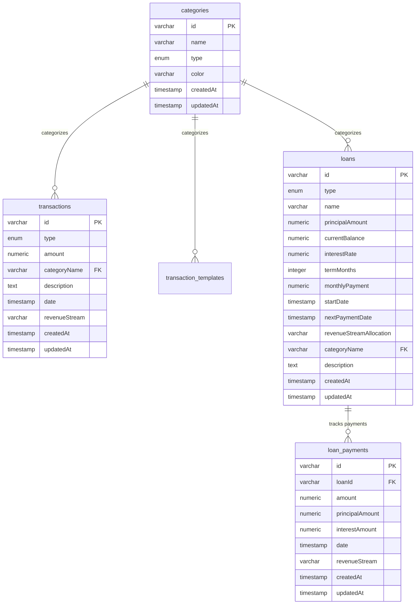

# Database Setup Guide for MISI Financial Management

This guide explains how to set up and use the Drizzle ORM schema for the MISI financial management application.

## 📊 Schema Overview

The database schema consists of five main entities that mirror your TypeScript interfaces:

### Tables

1. **`categories`** - Financial categories for income and expenses
2. **`transactions`** - Individual financial transactions
3. **`transaction_templates`** - Reusable templates for common transactions
4. **`loans`** - Borrowed and lent money with payment schedules
5. **`loan_payments`** - Individual loan payment records

### Key Features

- **Multi-project schema**: All tables are prefixed with `misi_` for database sharing
- **Type-safe enums**: Uses PostgreSQL enums for transaction types, category types, and loan types
- **Proper indexing**: Optimized for common query patterns
- **Relations**: Fully defined relationships between entities
- **Audit fields**: All tables include `createdAt` and `updatedAt` timestamps

## 🚀 Getting Started

### 1. Generate Migration

First, generate a migration from your schema:

```bash
bun run db:generate
```

This will create a new migration file in the `drizzle` folder based on your schema.

### 2. Run Migration

Apply the migration to your database:

```bash
bun run db:migrate
```

### 3. Seed Default Data

Populate the database with default categories and transaction templates:

```bash
bun run db:seed
```

This will add:

- 5 default income categories (Salary, Freelance, Business, Investments, Other Income)
- 8 default expense categories (Housing, Transportation, Food & Dining, etc.)
- 5 default transaction templates (Coffee, Gas Fill-up, Groceries, etc.)

### 4. Explore with Drizzle Studio (Optional)

Launch the visual database explorer:

```bash
bun run db:studio
```

## 📋 Entity Relationships



## 💡 Usage Examples

### Import Schema Types

```typescript
import {
  type Category,
  type Transaction,
  type Loan,
  type NewTransaction,
  categories,
  transactions,
  loans,
} from "~/server/db/schema";
```

### Query Examples

```typescript
// Get all income categories
const incomeCategories = await db
  .select()
  .from(categories)
  .where(eq(categories.type, "income"));

// Get transactions with category details
const transactionsWithCategories = await db
  .select()
  .from(transactions)
  .leftJoin(categories, eq(transactions.categoryName, categories.name))
  .orderBy(desc(transactions.date));

// Get loans with their payments
const loansWithPayments = await db
  .select()
  .from(loans)
  .leftJoin(loanPayments, eq(loans.id, loanPayments.loanId));
```

### Insert Examples

```typescript
// Create a new transaction
const newTransaction: NewTransaction = {
  id: crypto.randomUUID(),
  type: "expense",
  amount: "45.50",
  categoryName: "Food & Dining",
  description: "Dinner at restaurant",
  date: new Date(),
  revenueStream: "Salary",
};

await db.insert(transactions).values(newTransaction);

// Create a new loan
const newLoan: NewLoan = {
  id: crypto.randomUUID(),
  type: "borrowed",
  name: "Car Loan",
  principalAmount: "25000.00",
  currentBalance: "25000.00",
  interestRate: "5.50",
  termMonths: 60,
  monthlyPayment: "478.32",
  startDate: new Date(),
  nextPaymentDate: new Date(Date.now() + 30 * 24 * 60 * 60 * 1000),
  revenueStreamAllocation: "Salary",
  categoryName: "Auto Loan",
  description: "2024 Honda Civic financing",
};

await db.insert(loans).values(newLoan);
```

## 🔧 Migration Workflow

### Development Workflow

1. **Make schema changes** in `src/server/db/schema.ts`
2. **Generate migration**: `bun run db:generate`
3. **Review the generated SQL** in the `drizzle` folder
4. **Apply migration**: `bun run db:migrate`
5. **Test your changes** with `bun run db:studio`

### Database Push (Alternative)

For rapid prototyping, you can push schema changes directly without migrations:

```bash
bun run db:push
```

⚠️ **Warning**: This bypasses migration history and should only be used in development.

## 📁 Files Structure

```
src/server/db/
├── schema.ts          # Database schema definitions
├── seed.ts            # Default data seeder
└── index.ts           # Database connection

drizzle/               # Generated migrations
├── _meta/
├── 0000_*.sql
└── ...

drizzle.config.ts      # Drizzle Kit configuration
```

## 🏷️ Type Safety

The schema provides full TypeScript type safety:

- **Select types**: `Category`, `Transaction`, `Loan`, etc.
- **Insert types**: `NewCategory`, `NewTransaction`, `NewLoan`, etc.
- **Inferred from schema**: Types are automatically generated from your Drizzle schema

## 🎯 Revenue Stream Logic

The application implements a revenue stream allocation system:

1. **Income transactions** create revenue streams based on their category name
2. **Expense transactions** are allocated to specific revenue streams
3. **Borrowed loans** can be paid from specific revenue streams
4. The system tracks remaining balance per revenue stream

This allows for sophisticated budget tracking and expense allocation across different income sources.

## 🛠️ Available Scripts

- `bun run db:generate` - Generate new migration from schema changes
- `bun run db:migrate` - Apply pending migrations to database
- `bun run db:push` - Push schema changes directly (development only)
- `bun run db:seed` - Populate database with default data
- `bun run db:studio` - Open Drizzle Studio for database exploration

## 📚 Further Reading

- [Drizzle ORM Documentation](https://orm.drizzle.team/docs/overview)
- [PostgreSQL Data Types](https://orm.drizzle.team/docs/column-types/pg)
- [Drizzle Relations](https://orm.drizzle.team/docs/rqb#relation-queries)
- [Migration Best Practices](https://orm.drizzle.team/docs/migrations)
